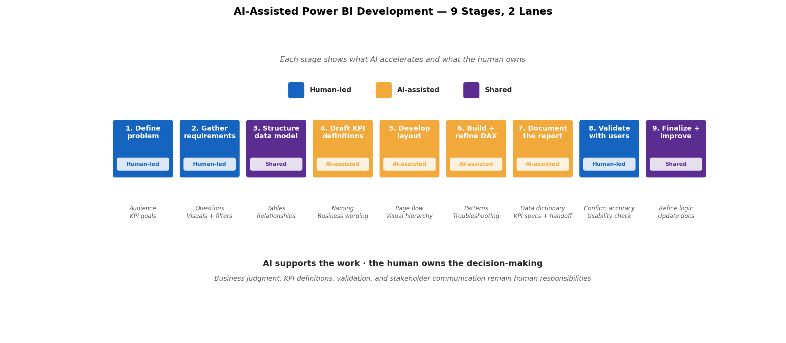
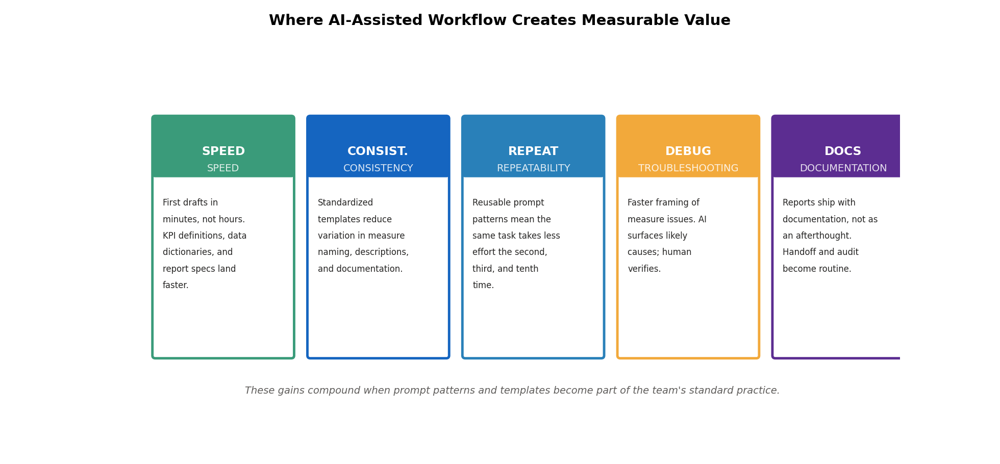
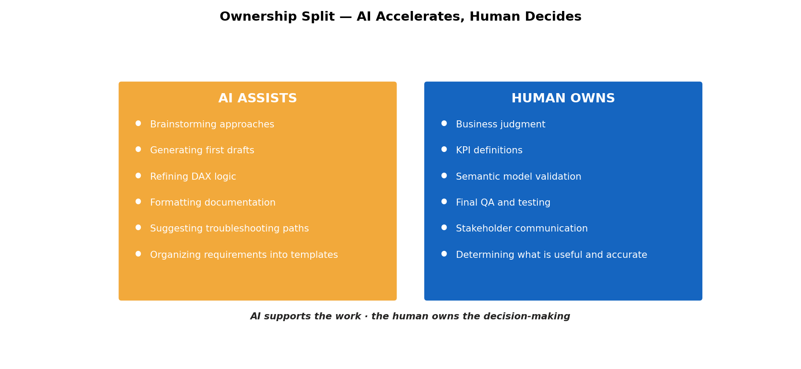
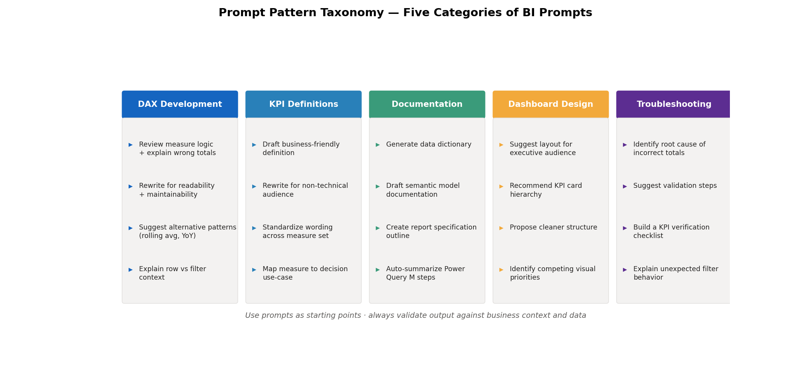

# AI-Assisted Power BI Workflows

<p align="left">
  
  
  
  
  
</p>

A practical framework for using AI to accelerate Power BI development without giving up business judgment, validation, or accountability. Documents the human + AI ownership split across the full BI lifecycle, with prompt patterns, DAX debugging examples, and reusable templates.

---

> [!IMPORTANT]
> AI supports the work · the human owns the decision-making. This framework is built around that principle. Examples may use sample, recreated, or masked content to protect confidentiality while still showing process, structure, and problem-solving methods.



---

## Business Questions This Project Answers

| Question | Where it's addressed |
|---|---|
| **How can we shorten BI development cycles without sacrificing quality?** | 9-stage workflow with explicit ownership lanes |
| **Where in the development cycle does AI add the most value?** | Stages 4–7 are AI-assisted; stages 1, 2, 8 stay human-led |
| **How do we structure prompts so AI output is usable, not generic?** | Prompt taxonomy with five reusable categories |
| **What's the human / AI split that keeps accountability intact?** | Ownership matrix — what AI assists vs what the human owns |
| **How do we standardize documentation so handoff and audit get easier?** | Data dictionary, KPI definition, and report-spec templates |
| **What's the troubleshooting pattern for common DAX issues?** | Three worked debugging examples with before / after measures |
| **How do we capture reasoning during issue resolution?** | Issue-to-resolution log format |
| **What are the limits of AI in BI development?** | Explicit benefits + limitations section |

---

## Why This Matters

BI work involves repetitive tasks that slow delivery — drafting documentation, refining measures, organizing requirements, troubleshooting calculations. A structured AI-assisted workflow can:

- Reduce repetitive manual work
- Speed up first drafts and iteration cycles
- Improve consistency in documentation
- Support faster troubleshooting and problem framing
- Make report development more scalable and repeatable

Used properly, AI is a practical assistant that helps BI professionals move faster while still maintaining quality, control, and business context.



---

## Human + AI Ownership Model

This workflow is built on a single principle:

> **AI supports the work. The human owns the decision-making.**



This distinction is critical. AI can accelerate the process, but it cannot replace business understanding, data validation, or accountability.

---

## The 9-Stage Workflow

Each stage is tagged with its ownership lane so it's clear where AI accelerates vs where the human stays in control.

| # | Stage | Lane | What happens |
|---|---|---|---|
| 1 | Define the business problem | Human-led | Audience, decision need, KPI goals, reporting expectations |
| 2 | Gather requirements | Human-led | Business questions, required visuals, filters, timeframes |
| 3 | Structure the data model | Shared | Tables, relationships, dimensions, facts, gaps |
| 4 | Draft KPI definitions | AI-assisted | Naming, calculation notes, business-friendly wording |
| 5 | Develop report layout | AI-assisted | Page flow, visual hierarchy, layout prototypes |
| 6 | Build and refine DAX | AI-assisted | Patterns, troubleshooting, alternative formulations |
| 7 | Document the report | AI-assisted | Data dictionaries, report specs, handoff notes |
| 8 | Validate with users | Human-led | Confirm accuracy, usability, business fit |
| 9 | Finalize and improve | Shared | Refine logic, layout, documentation, reusable assets |

---

## Prompt Pattern Taxonomy

Five categories of reusable BI prompts. Use them as starting points; always validate output against business context and data.



### DAX development
- Review this DAX measure and explain why the totals may be incorrect
- Rewrite this measure for better readability and maintainability
- Suggest an alternative pattern for calculating rolling averages
- Explain row context vs filter context in this example

### KPI definitions
- Draft a business-friendly KPI definition for executive reporting
- Rewrite this KPI description for a non-technical audience
- Create a consistent KPI definition table for these measures

### Documentation
- Generate a data dictionary for the following columns
- Draft semantic model documentation for these tables and relationships
- Create a report specification outline for an operations dashboard

### Dashboard design
- Suggest a dashboard layout for an executive audience
- Recommend KPI card hierarchy for a performance reporting page
- Propose a cleaner visual structure for a dashboard with too many competing priorities

### Troubleshooting
- Identify possible causes of incorrect totals in this matrix visual
- Suggest validation steps for a measure that appears inconsistent across filters
- Help create a test checklist for verifying KPI accuracy

---

## DAX Debugging Examples

### Example 1 — Incorrect total in a matrix

**Problem:** measure returns correct row values, but the grand total is wrong.

**Original (anti-pattern):**
```DAX
Open Cases =
IF(Operations[Status] = "Open", 1, 0)
```

**Improved:**
```DAX
Open Cases =
CALCULATE(
    COUNTROWS(Operations),
    Operations[Status] = "Open"
)
```

**AI assist:** identifying that a calculated-column pattern is being used where a measure is more appropriate.
**Human validation:** confirm the final total matches expected business logic and filtered report output.

---

### Example 2 — Completion rate needs safe division

**Problem:** measure returns errors or blanks when the denominator is zero.

**Original:**
```DAX
Completion Rate = [Completed Items] / [Total Items]
```

**Improved:**
```DAX
Completion Rate =
DIVIDE([Completed Items], [Total Items], 0)
```

**AI assist:** suggest safer, more readable DAX patterns quickly.
**Human validation:** verify that returning `0` is the correct business behavior when no total items exist.

---

### Example 3 — Average resolution days

**Problem:** calculate average duration between open and close dates for completed cases only.

**Measure:**
```DAX
Average Resolution Days =
AVERAGEX(
    FILTER(Operations, NOT(ISBLANK(Operations[CloseDate]))),
    DATEDIFF(Operations[OpenDate], Operations[CloseDate], DAY)
)
```

**AI assist:** structure the initial formula and explain each part of the logic.
**Human validation:** confirm that the population being averaged matches the intended KPI definition.

---

## Documentation Templates

Three reusable templates that support cleaner BI delivery and handoff.

| Template | Used to document |
|---|---|
| **Data Dictionary** | Field name · business definition · source table · data type · transformation notes · usage notes |
| **KPI Definition** | KPI name · formula · business meaning · owner · caveats · validation method |
| **Report Specification** | Report name · audience · business objective · KPIs · visuals · filters · refresh cadence · validation notes |

These standardize report development and improve communication across technical and business audiences.

---

## Issue-to-Resolution Logs

Issue logs capture how problems were identified, explored, and resolved during development.

| Issue | AI Support Used For | Human Validation Step | Final Resolution |
|---|---|---|---|
| Incorrect total in matrix | Suggested possible filter-context issues | Tested against filtered report views | Updated measure logic |
| KPI description unclear | Drafted business-friendly wording | Reviewed for stakeholder clarity | Revised KPI definition |
| Dashboard too cluttered | Suggested cleaner layout hierarchy | Compared against business priorities | Simplified top-level design |
| Missing documentation | Generated initial report spec draft | Validated against actual requirements | Completed final documentation |

This kind of logging creates a useful record of reasoning, iteration, and quality control.

---

## Benefits and Limits

### Benefits
- Faster first drafts
- Improved documentation consistency
- Better troubleshooting framing
- Reusable workflow patterns
- Lower repetitive reporting overhead
- Improved process standardization

### Limits
- AI can suggest incorrect logic
- DAX recommendations still require testing
- KPI definitions still need business alignment
- Dashboard design still requires stakeholder context
- Semantic models still need careful validation
- Final accountability remains with the human developer

The strongest use of AI in BI is not blind automation. It is **disciplined augmentation**.

---

## Tech Stack

- **Power BI Desktop** — authoring and validation surface
- **DAX** — measure refinement, troubleshooting, alternative patterns
- **Power Query (M)** — ETL standardization
- **Markdown templates** — data dictionary, KPI specs, report specs
- **Prompt patterns** — reusable categories for common BI tasks

---

## Repository Layout

```
ai-assisted-powerbi-workflows/
├── README.md
├── docs/
│   ├── overview.md
│   └── report-prototyping-workflow.md
├── examples/
│   └── dax-debugging-examples.md
├── prompts/
│   └── bi-prompt-patterns.md
├── templates/
│   ├── data-dictionary-template.md
│   ├── kpi-definition-template.md
│   └── report-spec-template.md
├── logs/
│   └── issue-resolution-log.md
├── images/
│   ├── 01-human-ai-workflow.png
│   ├── 02-prompt-categories.png
│   ├── 03-human-vs-ai.png
│   └── 04-impact-diagram.png
└── scripts/
    └── generate_visuals.py
```

---

## Connect

- 🔗 [LinkedIn](https://www.linkedin.com/in/jas0n-ch0i/)
- 📧 [Email me](mailto:jchoi815@gmail.com)
